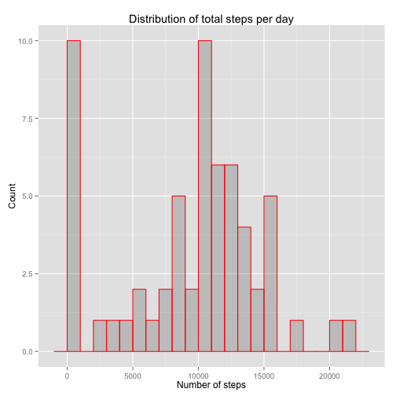
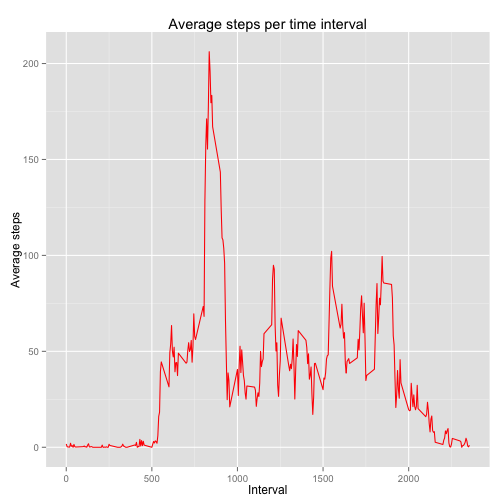
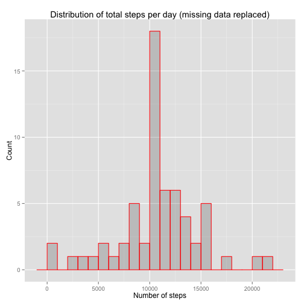
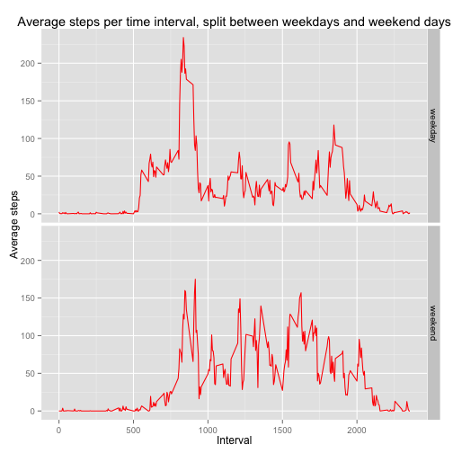

## Loading and preprocessing the data

```r
unzip("activity.zip",overwrite=TRUE)
data<-read.csv("activity.csv",header=TRUE)
```

## What is mean total number of steps taken per day?
I first need to calculate total steps per day.

```r
by.day<-group_by(data,date)
daily.data<-summarise(by.day,total.steps=sum(steps,na.rm=TRUE))

g<-ggplot(daily.data,aes(total.steps)) + 
    geom_histogram(col="red",alpha=0.2,binwidth=1000) +
    labs(title="Distribution of total steps per day") +
    labs(x="Number of steps",y="Count")
print(g)
```

 

```r
mean.steps=mean(daily.data$total.steps,na.rm=TRUE)
median.steps=median(daily.data$total.steps,na.rm=TRUE)
```

The mean number of steps per day is 9354.23 and the median number of steps is 10395. 


## What is the average daily activity pattern?

```r
by.interval<-group_by(data,interval)
interval.data<-summarise(by.interval,mean.steps=mean(steps,na.rm=TRUE))
g<-ggplot(interval.data,aes(x=interval,y=mean.steps)) + 
    geom_line(colour="red") +
    labs(title="Average steps per time interval") +
    labs(x="Interval",y="Average steps")
print(g)
```

 

```r
max.interval=which.max(interval.data$mean.steps)
max.interval.starttime=interval.data$interval[max.interval]
```
The interval with the highest average number of steps is the interval labelled 835 (i.e. 835 <=time< 840).

## Imputing missing values

```r
num.NAs<-sum(is.na(data$steps))
```
There are 2304 missing values.

```r
# Find missing values & replace them with mean value for that time interval across all days 
NAs<-which(is.na(data$steps))
data$newsteps<-data$steps
for (ii in NAs) {
    interval<-data$interval[ii]
    ii2<-which(interval.data$interval==interval)
    data$newsteps[ii]<-interval.data$mean.steps[ii2]
}

# Calculate the total daily steps after replacement of missing values
by.day<-group_by(data,date)
daily.data<-summarise(by.day,total.steps=sum(steps,na.rm=TRUE),total.newsteps=sum(newsteps,na.rm=FALSE))

g<-ggplot(daily.data,aes(total.newsteps)) + 
    geom_histogram(col="red",alpha=0.2,binwidth=1000) +
    labs(title="Distribution of total steps per day (missing data replaced)") +
    labs(x="Number of steps",y="Count")
print(g)
```

 

```r
mean.newsteps=mean(daily.data$total.newsteps,na.rm=FALSE)
median.newsteps=median(daily.data$total.newsteps,na.rm=FALSE)
```
The mean number of steps per day is 10766.189 and the median number of steps is 10766.189. These values are slightly higher than the estimates prior to replacement of missing values, and the mean and median are now equal.


## Are there differences in activity patterns between weekdays and weekends?

```r
# Determine which day of the week each date corresponds to and add to dataset
data$days<-weekdays(as.POSIXct(data$date))
data$weekend<-rep("weekday",length(data$days))
data$weekend[which(data$days=="Saturday"|data$days=="Sunday")]<-"weekend"
data$weekend<-as.factor(data$weekend)

# calculate mean steps per interval for weekdays and weekend days
by.interval.weekend<-group_by(data,interval,weekend)
int.we.data<-summarise(by.interval.weekend,mean.steps=mean(steps,na.rm=TRUE))

# plot mean steps per interval for weekdays and for weekends
g<-ggplot(int.we.data,aes(x=interval,y=mean.steps)) + 
    geom_line(colour="red") +
    facet_grid(weekend ~ .) +
    labs(title="Average steps per time interval, split between weekdays and weekend days") +
    labs(x="Interval",y="Average steps")
print(g)
```

 
